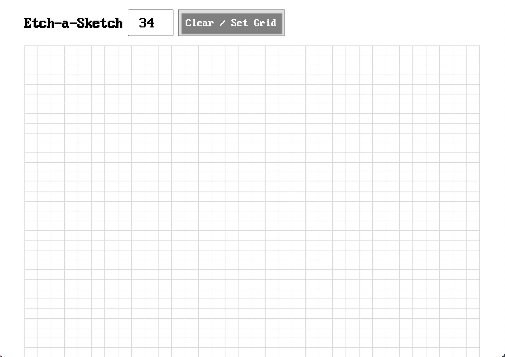
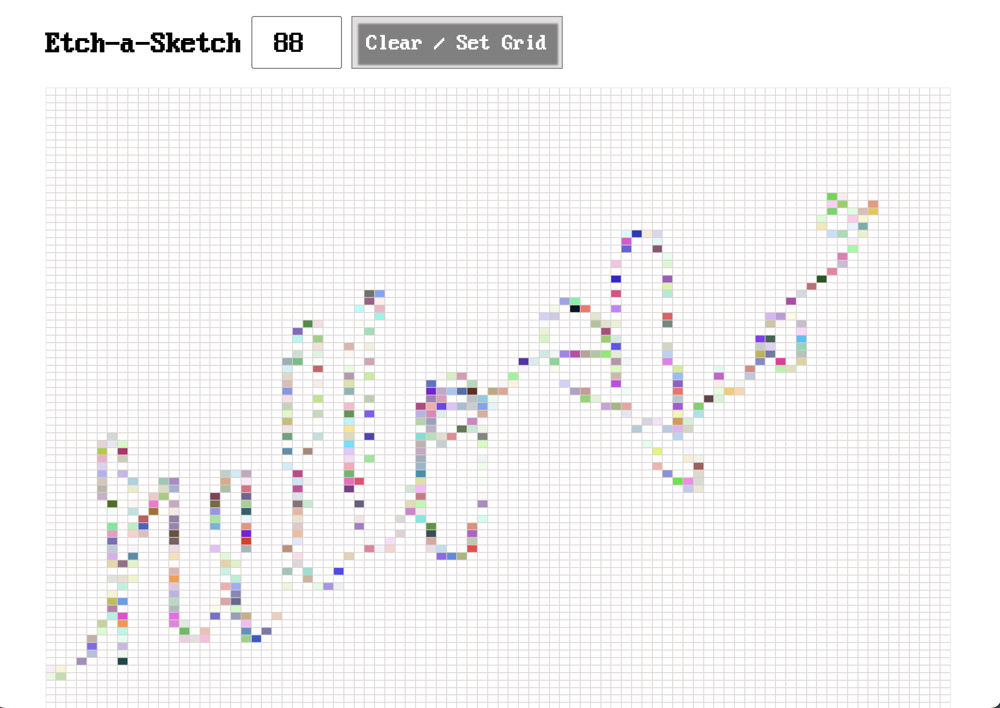

# etch-a-sketch

## description
### what it does
etch-a-sketch is a grid-based paint-type tool that allows you to set a grid of N x N where N = number of squares with a current maximum of N = 100. by hovering over the grid, you can create illustrations, and by changing the number of squares, you can add varying levels of detail.

### technologies used
created in vs-code on my Macbook Air (M1, 2020) running MacOS Sequoia 15

### challenges
I first created everything only in javascript in the DOM and did not directly add elements to the css or html file other than the first container. while difficult, it was a also a great exercise in DOM manipulation.

### upcoming features
I plan to add the following features to make this more intriguing:
+ sound effects
+ animations
+ paint brush choices
+ increased pixalation (number of squares)

## how to use etch-a-sketch

you can use etch-a-sketch via github's website [preview link here](https://aliensprout.github.io/etch-a-sketch/).
the grid's default value is 88 x 88 squares.

you can change the value by entering a number between 0 and 100 in the input field at the top then pressing the button "Clear / Reset Grid".

you can also clear the board by pressing this button and the number of squares will stay the same.

currently, etch-a-sketch's default paintbrush is set with a randomized rgba that changes the color upon every instance of passing over a square within the grid. I plan to create a paintbrush-color-picker.

## credits
this project idea and guidance was created by [the Odin Project](https://theodinproject.com) as part of their [Etch-a-Sketch project](https://www.theodinproject.com/lessons/foundations-etch-a-sketch) in their foundations course.

I referenced helpful resources and learning from [freeCodeCamp's](https://freecodecamp.org) full stack developer roadmap.
